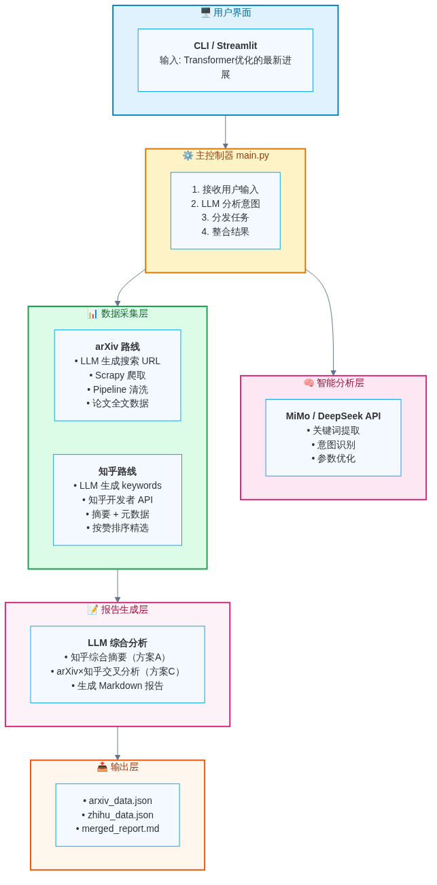
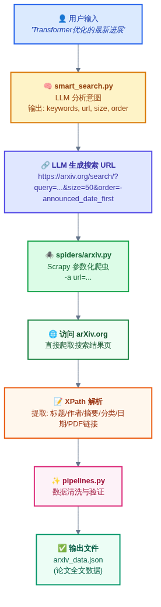
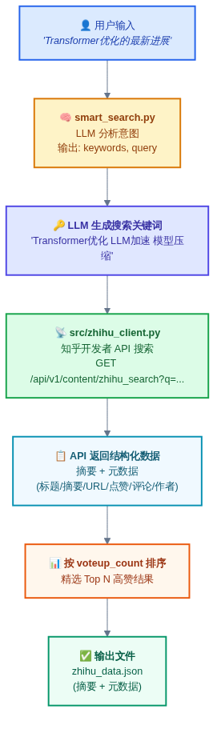

# KnowledgeHub 完整架构设计

---

## 一、系统总览



*图1: KnowledgeHub 系统整体架构*

---

## 二、两条数据流对比

### 2.1 arXiv 路线（Scrapy 爬取）



*图2: arXiv 数据采集流程*

**数据流:**

```
用户查询 → LLM 生成 arXiv URL → Scrapy 爬取搜索结果页 → Pipeline 清洗 → 论文全文数据
```

**为什么 arXiv 用 Scrapy 直接爬？**

| 原因 | 说明 |
|------|------|
| 自带搜索功能 | arXiv 网页搜索支持关键词 + AND/OR/NOT + 排序 |
| 访问稳定 | 无反爬限制，直接连接即可 |
| 精确控制 | 可利用 arXiv 特有的排序（相关性/时间）和分页 |
| 数据完整 | 搜索结果页包含标题/作者/摘要/分类/日期/PDF链接 |

**输出字段:** title, authors, abstract, categories, submitted_date, paper_url, pdf_url

---

### 2.2 知乎路线（API 搜索）



*图3: 知乎数据采集流程*

**数据流:**

```
用户查询 → LLM 生成 keywords → 知乎开发者 API 搜索 → 摘要 + 元数据
```

**为什么知乎用 API 而不是 Scrapy？**

| 原因 | 说明 |
|------|------|
| 反爬严格 | 知乎反爬机制强，Scrapy 直接爬会被封 |
| 官方 API | 知乎提供开发者搜索 API，合法稳定 |
| 数据够用 | API 返回摘要 + 点赞/评论/作者等元数据，满足精选推荐需求 |
| 无需全文 | 知乎内容的价值在于"精选链接 + 综合摘要"，不需要逐条爬全文 |

**为什么不用 TinyFish？**

| 原因 | 说明 |
|------|------|
| 官方 API 更稳定 | 知乎开发者 API 是官方渠道，比第三方代理更可靠 |
| 减少依赖 | 不需要额外付费的中间件 |
| 数据更准确 | 官方 API 返回结构化数据，无需解析 HTML |

**输出字段:** title, excerpt, url, voteup_count, comment_count, author_name, authority_level, ranking_score

---

## 三、完整 Workflow（A+C 方案）

### 场景

> **用户输入**: "我想了解 Transformer 优化的最新进展"

---

### Step 1: LLM 智能分析

`src/smart_search.py` → `smart_search()`

LLM 分析用户意图，生成两条路线的搜索参数：

```json
{
  "intent": "理论+实践综合调研",

  "arxiv": {
    "url": "https://arxiv.org/search/?searchtype=all&query=Transformer%20AND%20optimization&abstracts=show&size=50&order=-announced_date_first",
    "keywords": "Transformer AND optimization",
    "size": 50
  },

  "zhihu": {
    "query": "Transformer优化 LLM加速 模型压缩",
    "limit": 15
  }
}
```

---

### Step 2: 并行采集数据

#### arXiv 分支

| 步骤 | 模块 | 操作 | 输出 |
|------|------|------|------|
| 1 | `smart_search.py` | LLM 生成搜索 URL | arXiv 搜索页 URL |
| 2 | `spiders/arxiv.py` | Scrapy 爬取搜索结果页 | 论文原始数据 |
| 3 | `pipelines.py` | Pipeline 清洗 | 过滤空值、格式统一 |
| 4 | — | 最终结果 | **论文全文数据** |

**采样输出:**
- 📄 论文1: Flash Attention 2: Faster and Better Attention...
- 📄 论文2: GPTQ: Accurate Post-Training Quantization...
- 📄 论文3: SmoothQuant: Accurate and Efficient Post-Training...

---

#### 知乎分支

| 步骤 | 模块 | 操作 | 输出 |
|------|------|------|------|
| 1 | `smart_search.py` | LLM 生成搜索关键词 | 中文关键词 |
| 2 | `zhihu_client.py` | 调用知乎搜索 API | 摘要 + 元数据 |
| 3 | — | 按 voteup_count 排序 | 精选结果 |

**采样输出:**
- 💬 ⬆️2345赞 Transformer推理加速实战总结
- 💬 ⬆️1890赞 LLM量化从GPTQ到AWQ全对比
- 💬 ⬆️956赞 小白如何入门模型优化

---

### Step 3: LLM 综合分析（方案 A + C）

`src/report_generator.py` → `generate_report()`

将 arXiv 论文数据 + 知乎讨论数据一起喂给 LLM，生成两类分析：

**方案 A: 知乎综合摘要**

> "知乎社区主要关注三个方向：工程加速（Flash Attention、vLLM）、模型压缩（量化、剪枝）、训练技巧（混合精度、梯度累积）"

**方案 C: arXiv × 知乎交叉分析**

| 方向 | arXiv 理论 | 知乎实践 |
|------|-----------|---------|
| 加速 | Flash Attention 2 论文提出... | 工程师实测加速3倍 |
| 量化 | GPTQ 论文证明4bit无损... | 踩坑经验：哪些模型能量化 |
| 剪枝 | SparseGPT 论文提出... | 实际部署效果不如预期 |

---

### Step 4: 输出报告

```markdown
# Transformer 优化调研报告

## 理论研究 (arXiv)
- Flash Attention 2: 论文摘要...
- GPTQ 量化: 论文摘要...

## 工程实践 (知乎)
> 社区主要关注：工程加速/模型压缩/训练技巧
- ⬆️2.3k 实战总结 → url
- ⬆️1.8k 量化对比 → url

## 理论 × 实践对照
| 方向 | arXiv 理论 | 知乎实践 |
| 加速 | FA2论文 | 实测3倍提速 |
| 量化 | GPTQ论文 | 踩坑经验 |
```

---

## 四、技术栈说明

| 模块 | 使用技术 | 说明 |
|------|---------|------|
| **智能分析** | MiMo / DeepSeek API | LLM 意图识别 + 关键词生成 + URL 构建 |
| **arXiv 搜索** | Scrapy + XPath | 直接访问 arXiv.org，LLM 生成搜索 URL |
| **知乎搜索** | 知乎开发者 API | 官方搜索接口，返回摘要 + 元数据 |
| **数据处理** | Scrapy Pipeline | 清洗 / 验证 / 格式统一 |
| **综合分析** | MiMo / DeepSeek API | LLM 生成交叉分析报告 |
| **输出格式** | Markdown + JSON | 结构化文档输出 |

---

## 五、开发进度

### Phase 1: 核心功能 ✅ 已完成

| 任务 | 文件路径 | 完成状态 | 说明 |
|------|---------|----------|------|
| arXiv 爬虫 | `knowledge_hub/spiders/arxiv.py` | ✅ 完成 | 7个字段，支持 `-a url` 动态 URL |
| 数据处理管道 | `knowledge_hub/pipelines.py` | ✅ 完成 | 自动清洗空值、格式统一化、链接验证 |
| 数据结构定义 | `knowledge_hub/items.py` | ✅ 完成 | ArxivItem 定义 |
| Scrapy 配置 | `knowledge_hub/settings.py` | ✅ 完成 | Pipeline 启用、下载延迟、并发控制 |
| 搜索策略知识库 | `src/search_strategy.py` | ✅ 完成 | arXiv 网页搜索语法规则 |
| 智能搜索 | `src/smart_search.py` | ✅ 完成 | LLM 生成搜索 URL，支持 mock 模式 |
| LLM 客户端 | `src/llm_client.py` | ✅ 完成 | chat/chat_text/chat_json，重试+token追踪 |
| 配置管理 | `src/config.py` | ✅ 完成 | MiMo/DeepSeek/Zhihu 配置，.env 加载 |

---

### Phase 2: 知乎接入 ✅ 已完成

| 任务 | 文件路径 | 完成状态 | 说明 |
|------|---------|----------|------|
| 知乎搜索客户端 | `src/zhihu_client.py` | ✅ 完成 | 封装知乎开发者搜索 API，重试+429退避+401快速失败 |
| 多数据源路由 | `src/smart_search.py` | ✅ 完成 | LLM 一次生成 arXiv + 知乎双数据源参数 |
| 知乎搜索策略 | `src/search_strategy.py` | ✅ 完成 | 新增 ZHIHU_SEARCH_STRATEGY + COMBINED_SEARCH_STRATEGY |

---

### Phase 3: 报告生成 ✅ 已完成

| 任务 | 文件路径 | 完成状态 | 说明 |
|------|---------|----------|------|
| 报告生成器 | `src/report_generator.py` | ✅ 完成 | 方案A+C，LLM 综合分析生成 Markdown 报告 |
| 主程序入口 | `main.py` | ✅ 完成 | 统一调度，arXiv+知乎并行搜索，支持 --mock/--no-arxiv/--no-zhihu |

---

### Phase 4: 可视化展示 ⏳ 待开发

| 任务 | 说明 |
|------|------|
| Markdown 报告输出 | 自动生成人类可读的调研报告 |
| Streamlit Web 界面 | 交互式数据展示 |
| 导出功能 | 支持 PDF/Word/Excel 导出 |

---

## 六、关键设计决策

### 决策1: arXiv 用 Scrapy 直接爬

| 因素 | 选择直接爬的优势 |
|------|-----------------|
| 性能 | 延迟更低，响应更快 |
| 功能 | 可精确控制排序和过滤条件 |
| 稳定性 | 无反爬限制，减少对外部服务的依赖 |
| 数据完整 | 搜索结果页包含论文全文摘要 |

---

### 决策2: 知乎用开发者 API

| 因素 | 选择 API 的优势 |
|------|----------------|
| 安全性 | 官方渠道，不会被封 |
| 稳定性 | 结构化 JSON 返回，无需解析 HTML |
| 合规性 | 使用官方授权接口 |
| 够用性 | 摘要 + 元数据足以支撑精选推荐和综合分析 |

**不选 Scrapy 的原因:** 知乎反爬严格，直接爬会被封禁

**不选 TinyFish 的原因:** 已有官方 API，无需额外中间件

---

### 决策3: 知乎数据的价值定位

知乎 API 只返回摘要，不返回全文。价值体现在：

| 价值 | 实现方式 |
|------|---------|
| **精选推荐** | 按 voteup_count 排序，筛选高赞内容 |
| **综合摘要** | LLM 汇总多条摘要，生成社区观点概述 |
| **交叉分析** | arXiv 理论 × 知乎实践对照，1+1>2 |
| **链接索引** | 高赞原文链接，供用户深入阅读 |

---

### 决策4: LLM 放在最上层

| 因素 | 统一放在上层的好处 |
|------|------------------|
| 意图理解 | 全局统一的用户意图分析 |
| 参数优化 | 跨数据源的全局最优选择 |
| 协调能力 | 可以协调多个数据源的采集 |
| 成本控制 | 避免每个模块都调用 LLM（省钱） |

---

## 七、项目文件结构

```
KnowledgeHub/
│
├── src/                           ← 核心模块
│   ├── __init__.py
│   ├── config.py                  配置管理 ✅
│   ├── llm_client.py              LLM 客户端 ✅
│   ├── search_strategy.py         搜索策略知识库 ✅
│   ├── smart_search.py            智能搜索 ✅
│   ├── zhihu_client.py            知乎搜索客户端 ✅
│   └── report_generator.py        报告生成器 ✅
│
├── knowledge_hub/                 ← Scrapy 项目
│   ├── knowledge_hub/
│   │   ├── settings.py            Scrapy 配置 ✅
│   │   ├── items.py               数据结构 ✅
│   │   ├── pipelines.py           数据清洗 ✅
│   │   └── spiders/
│   │       └── arxiv.py           arXiv 爬虫 ✅
│   └── scrapy.cfg
│
├── docs/                          ← 文档目录
│   ├── architecture.md            本文档
│   ├── reference.md               arXiv 搜索规范
│   └── diagrams/                  流程图目录
│       ├── system-overview.*      系统总览图
│       ├── arxiv-flow.*           arXiv 流程图
│       ├── zhihu-flow.*           知乎流程图
│       └── tinyfish-role.*        TinyFish 角色图
│
├── output/                        ← 输出目录
│   ├── arxiv_data.json            arXiv 爬取结果
│   ├── zhihu_data.json            知乎搜索结果
│   └── report_*.md                生成的调研报告
│
├── main.py                        ← 统一调度入口 ✅
├── .env                           环境变量（不提交）
├── .env.example                   环境变量示例
└── README.md                      项目说明
```

---

## 八、快速开始

### 当前可用的命令

```bash
# 1. 运行 arXiv 爬虫（默认 URL）
cd knowledge_hub
scrapy crawl arxiv -o output/arxiv_data.json

# 2. 运行 arXiv 爬虫（LLM 生成的 URL）
scrapy crawl arxiv -a url="https://arxiv.org/search/?searchtype=all&query=Transformer%20AND%20optimization&abstracts=show&size=50&order=-announced_date_first"

# 3. 测试智能搜索
cd ..
python -m src.smart_search

# 4. 测试 LLM 连接
python -m src.llm_client

# 5. 测试知乎搜索
python -m src.zhihu_client
```

### 完整流程

```bash
# 一键运行完整流程（arXiv + 知乎）
python main.py "我想了解 Transformer 优化的最新进展"

# 只搜索知乎
python main.py "Transformer优化" --no-arxiv

# 只搜索 arXiv
python main.py "Transformer优化" --no-zhihu

# Mock 模式（不调用 LLM 生成搜索参数）
python main.py "Transformer优化" --mock
```

---

## 九、核心文件索引

| 文件路径 | 用途 | 开发状态 |
|---------|------|----------|
| `src/config.py` | 配置管理（LLM/知乎/通用） | ✅ 已完成 |
| `src/llm_client.py` | LLM 客户端（chat/chat_text/chat_json） | ✅ 已完成 |
| `src/search_strategy.py` | 搜索策略知识库（arXiv + 知乎 + 合并策略） | ✅ 已完成 |
| `src/smart_search.py` | 智能搜索（LLM → 双数据源参数） | ✅ 已完成 |
| `src/zhihu_client.py` | 知乎搜索 API 客户端 | ✅ 已完成 |
| `src/report_generator.py` | 报告生成器（方案A+C） | ✅ 已完成 |
| `knowledge_hub/spiders/arxiv.py` | arXiv 爬虫 | ✅ 已完成 |
| `knowledge_hub/items.py` | 数据结构定义（ArxivItem） | ✅ 已完成 |
| `knowledge_hub/pipelines.py` | 数据清洗和验证 | ✅ 已完成 |
| `main.py` | 主程序入口 | ✅ 已完成 |

---

## 附录: 流程图源文件

本文档中的所有流程图均使用 [Mermaid](https://mermaid.js.org/) 语法编写，源文件位于 `docs/diagrams/` 目录。

如需修改图片，请编辑对应的 `.mmd` 文件后重新运行：

```bash
cd docs/diagrams
mmdc -i <filename>.mmd -o <filename>.png -w 1200 -H 800 -b white
```

**可用图表:**

| 图表名称 | 文件名 | 用途 |
|---------|--------|------|
| 系统总览图 | `system-overview.*` | 展示整体架构和模块关系 |
| arXiv 流程图 | `arxiv-flow.*` | 展示 arXiv 数据采集的详细步骤 |
| 知乎流程图 | `zhihu-flow.*` | 展示知乎数据采集的详细步骤 |
| TinyFish 角色图 | `tinyfish-role.*` | 展示 TinyFish 支持的平台和功能 |

---

*最后更新: 2026-05-28*
