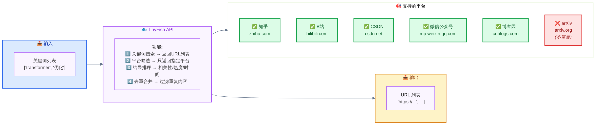

# KnowledgeHub 完整架构设计

---

## 一、系统总览


*图1: KnowledgeHub 系统整体架构*

---

## 二、两条数据流对比

### 2.1 arXiv 路线（直接访问）


*图2: arXiv 数据采集流程 - 不使用 TinyFish*

**为什么 arXiv 不用 TinyFish?**

| 原因 | 说明 |
|------|------|
| 自带搜索功能 | arXiv 有强大的搜索 API 和网页界面 |
| 访问稳定快速 | 直接连接比通过中间件更快 |
| 精确控制参数 | 可以利用 arXiv 特有的排序和过滤 |
| 减少依赖 | 无需依赖第三方服务 |

---

### 2.2 知乎路线（通过 TinyFish）


*图3: 知乎数据采集流程 - 使用 TinyFish 中间件*

**为什么知乎要用 TinyFish?**

| 原因 | 说明 |
|------|------|
| 反爬严格 | 知乎反爬机制强，直接搜索易被封 |
| 模拟用户行为 | TinyFish 可以模拟正常浏览 |
| 多平台扩展 | 同时支持 B站、CSDN 等 |
| 降低风险 | 减少被封禁的概率 |

---

## 三、TinyFish 的角色定位

### 3.1 它是什么？

```
TinyFish = 通用搜索引擎的"代理"
              ↓
帮你搜索多个平台，返回相关链接
```

### 3.2 支持的平台



*图4: TinyFish 支持的搜索平台*

### 3.3 API 调用示例

```python
import requests

def search_tinyfish(keywords: list, platform: str = "zhihu", limit: int = 20):
    """
    调用 TinyFish 搜索 API
    
    参数:
        keywords: 搜索关键词列表
        platform: 目标平台 ("zhihu", "bilibili", "csdn")
        limit: 返回结果数量
    
    返回:
        URL 列表
    """
    
    url = "https://api.tinyfish.com/v1/search"
    
    payload = {
        "query": " ".join(keywords),
        "platform": platform,
        "limit": limit,
        "sort_by": "relevance"  # 或 "hotness", "time"
    }
    
    headers = {
        "Authorization": f"Bearer {TINYFISH_API_KEY}",
        "Content-Type": "application/json"
    }
    
    response = requests.post(url, json=payload, headers=headers)
    data = response.json()
    
    # 提取 URL 列表
    urls = [item['url'] for item in data['results']]
    
    return urls


# 使用示例
keywords = ["transformer", "优化", "实战"]
zhihu_urls = search_tinyfish(keywords, platform="zhihu", limit=10)

print(f"找到 {len(zhihu_urls)} 条知乎结果:")
for url in zhihu_urls[:3]:
    print(f"  - {url}")
```

---

## 四、完整调用链路示例

### 场景

> **用户输入**: "我想了解 Transformer 优化的最新进展，包括理论研究和工程实践"

---

### Step 1: LLM 智能分析

```json
{
  "intent": "综合调研：理论+实践",
  
  "keywords": [
    "transformer optimization",
    "LLM efficiency",
    "attention mechanism improvement",
    "model compression"
  ],
  
  "data_sources": {
    "arxiv": {
      "enabled": true,
      "query": "(ti:transformer OR abs:optimization) AND (cat:cs.LG OR cat:cs.CL)",
      "sort_by": "submittedDate",
      "sort_order": "descending",
      "max_results": 30,
      "reason": "用户要求'最新进展'，优先显示最新论文"
    },
    
    "zhihu": {
      "enabled": true,
      "keywords": ["transformer优化", "LLM加速", "模型压缩"],
      "platform": "zhihu",
      "limit": 15,
      "reason": "用户提到'工程实践'，知乎有很多实践经验分享"
    }
  }
}
```

---

### Step 2: 并行采集数据

#### arXiv 分支执行过程

| 步骤 | 操作 | 输出 |
|------|------|------|
| 1 | 构建搜索 URL | `https://arxiv.org/search/?query=transformer+optimization&order=submittedDate` |
| 2 | Scrapy 爬取 | 30 篇论文原始数据 |
| 3 | Pipeline 清洗 | 过滤无效字段、格式统一 |
| 4 | 最终结果 | **28 条有效论文数据** |

**采样输出:**
- 📄 论文1: G3T Up! Gravity Aligned...
- 📄 论文2: PARE: Pruning and Adaptive...
- 📄 论文3: Probabilistic Smoothing...

---

#### 知乎分支执行过程

| 步骤 | 操作 | 输出 |
|------|------|------|
| 1 | TinyFish 搜索 | 发现 12 个相关问题 URL |
| 2 | 知乎爬虫抓取 | 提取回答内容、点赞数等 |
| 3 | Pipeline 清洗 | 过滤低质量/重复内容 |
| 4 | 最终结果 | **10 条高质量回答** |

**采样输出:**
- 💬 回答1: ⬆️1234赞 - 工程师实战经验
- 💬 回答2: ⬆️890赞 - 模型压缩技巧
- 💬 回答3: ⬆️567赞 - 训练加速方法

---

### Step 3: 整合输出

```json
{
  "total_results": 38,
  
  "sources": {
    "arxiv": {
      "count": 28,
      "fields": ["title", "authors", "abstract", "categories", "submitted_date", "paper_url"]
    },
    
    "zhihu": {
      "count": 10,
      "fields": ["question", "answer_content", "likes", "comments", "author"]
    }
  },
  
  "processing": {
    "quality_score": "基于点赞数/引用量/时效性",
    "deduplication": "去除重复内容",
    "summarization": "LLM 生成摘要"
  }
}
```

**输出文件结构:**

```
📁 output/
├── 📊 arxiv_data.json          (28条论文)
│   ├── 标题、作者、摘要
│   ├── 分类、日期
│   └── PDF链接
│
├── 💬 zhihu_data.json           (10条回答)
│   ├── 问题描述
│   ├── 回答内容
│   ├── 点赞数、评论数
│   └── 作者信息
│
├── 📝 merged_report.md          (Markdown报告)
│   ├── 执行摘要
│   ├── 论文综述
│   ├── 实践经验汇总
│   └── 参考资料列表
│
└── 📈 visualization/
    ├── timeline.png           (时间趋势图)
    ├── wordcloud.png          (词云图)
    └── comparison.png         (来源对比图)
```

---

## 五、技术栈说明

| 模块 | 使用技术 | 说明 |
|------|---------|------|
| **用户界面** | Streamlit | Web UI，简单易用 |
| **智能分析** | DeepSeek API | LLM 关键词提取 + 意图识别 |
| **arXiv 搜索** | Scrapy + XPath | 直接访问 arXiv.org |
| **通用搜索** | TinyFish API | 用于知乎/B站/CSDN等多平台 |
| **数据抓取** | Scrapy | 统一爬虫框架 |
| **数据处理** | Pandas + Pipeline | 清洗 / 验证 / 评分 |
| **内容总结** | DeepSeek API | AI 自动生成摘要 |
| **可视化** | Matplotlib | 生成各种图表 |
| **输出格式** | Markdown + JSON | 结构化文档输出 |

---

## 六、开发进度

### Phase 1: 核心功能 ✅ 已完成

| 任务 | 文件路径 | 完成状态 | 说明 |
|------|---------|----------|------|
| arXiv 爬虫 | `spiders/arxiv.py` | ✅ 完成 | 能抓取7个字段，支持动态URL |
| 数据处理管道 | `pipelines.py` | ✅ 完成 | 自动清洗空值、格式统一化、链接验证 |
| 搜索策略知识库 | `search_strategy.py` | ✅ 完成 | 包含5种典型场景的最佳实践 |
| 智能参数生成器 | `smart_search.py` | ✅ 完成 | 根据需求选择最优参数（当前为模拟版） |

---

### Phase 2: 多源采集 🔄 进行中

| 任务 | 文件路径 | 完成状态 | 说明 |
|------|---------|----------|------|
| TinyFish 客户端封装 | `tinyfish_client.py` | 🔲 待开发 | 封装API调用逻辑、错误处理和重试机制 |
| 知乎爬虫开发 | `spiders/zhihu.py` | 🔲 待开发 | 接收TinyFish返回的URL、提取问答内容 |
| 数据源路由逻辑 | `main.py` | 🔲 待开发 | 判断走哪条路线、并发任务调度 |
| 并发采集框架 | - | 🔲 待开发 | 支持多数据源并行采集 |

---

### Phase 3: 智能增强 ⏳ 待开发

| 任务 | 说明 |
|------|------|
| 接入真实 LLM (DeepSeek) | 替换 smart_search.py 的模拟版本 |
| 内容自动总结 | 对采集的数据生成摘要 |
| 质量评估算法 | 基于点赞数/引用量/时效性评分 |
| 个性化推荐 | 根据用户历史偏好推荐内容 |

---

### Phase 4: 可视化展示 ⏳ 待开发

| 任务 | 说明 |
|------|------|
| Matplotlib 图表 | 时间趋势图、词云图、来源对比图 |
| Markdown 报告生成 | 自动生成人类可读的报告 |
| Streamlit Web 界面 | 交互式数据展示 |
| 导出功能 | 支持 PDF/Word/Excel 导出 |

---

## 七、关键设计决策

### 决策1: 为什么 arXiv 不走 TinyFish?

**结论**: 直接访问 arXiv.org

| 因素 | 选择直接访问的优势 |
|------|-------------------|
| 性能 | 延迟更低，响应更快 |
| 功能 | 可精确控制排序和过滤条件 |
| 稳定性 | 减少对外部服务的依赖 |
| 成本 | 无需支付第三方服务费用 |

---

### 决策2: 为什么知乎要走 TinyFish?

**结论**: 通过 TinyFish 搜索

| 因素 | 选择 TinyFish 的优势 |
|------|---------------------|
| 安全性 | 降低被知乎封禁的风险 |
| 扩展性 | 支持多平台（B站、CSDN等） |
| 行为模拟 | 模拟正常用户浏览模式 |
| 结果质量 | 返回更相关的链接 |

---

### 决策3: LLM 放在哪一层?

**结论**: 最上层（主控制器 main.py）

| 因素 | 统一放在上层的好处 |
|------|------------------|
| 意图理解 | 全局统一的用户意图分析 |
| 参数优化 | 跨数据源的全局最优选择 |
| 协调能力 | 可以协调多个数据源的采集 |
| 成本控制 | 避免每个模块都调用 LLM（省钱） |

---

## 八、项目文件结构

```
knowledge_hub/
│
├── knowledge_hub/                 ← Scrapy 项目
│   ├── settings.py               配置文件 ✅
│   ├── items.py                  数据结构 ✅
│   ├── pipelines.py              数据清洗 ✅
│   └── spiders/
│       ├── arxiv.py              arXiv爬虫 ✅
│       └── zhihu.py              知乎爬虫 🔲
│
├── docs/                         ← 文档目录
│   ├── requirements.md           需求文档
│   ├── architecture.md           本文档
│   └── diagrams/                ← 流程图目录 🆕
│       ├── system-overview.mmd   Mermaid源文件
│       ├── system-overview.png   系统总览图
│       ├── arxiv-flow.mmd
│       ├── arxiv-flow.png        arXiv流程图
│       ├── zhihu-flow.mmd
│       ├── zhihu-flow.png        知乎流程图
│       ├── tinyfish-role.mmd
│       └── tinyfish-role.png     TinyFish角色图
│
├── search_strategy.py            搜索策略库 ✅
├── smart_search.py               智能参数生成 ✅
├── tinyfish_client.py            TinyFish客户端 🔲
├── main.py                       主程序入口 🔲
│
├── src/
│   └── app.py                    Web界面 🔲
│
├── output/                       ← 输出目录
│   ├── arxiv_data.json          已有测试数据
│   └── zhihu_data.json
│
└── README.md                     项目说明
```

---

## 九、快速开始

### 当前可用的命令

```bash
# 1. 运行 arXiv 爬虫
cd knowledge_hub
scrapy crawl arxiv -o output/arxiv_data.json

# 2. 测试智能搜索（当前为模拟版）
python smart_search.py

# 3. 查看输出结果
cat output/arxiv_data.json | head -20
```

### 未来完整流程（开发完成后）

```bash
# 一键运行完整流程
python main.py "我想了解 Transformer 优化的最新进展"

# 启动 Web 界面
streamlit run src/app.py
```

---

## 十、核心文件索引

| 文件路径 | 用途 | 开发状态 |
|---------|------|----------|
| `spiders/arxiv.py` | arXiv 爬虫主逻辑 | ✅ 已完成 |
| `items.py` | ArxivItem/ZhihuItem 定义 | ✅ 已完成 |
| `pipelines.py` | 数据清洗和验证 | ✅ 已完成 |
| `settings.py` | Scrapy 全局配置 | ✅ 已完成 |
| `search_strategy.py` | 搜索参数知识库 | ✅ 已完成 |
| `smart_search.py` | LLM 参数生成器（模拟版） | ✅ 已完成 |
| `tinyfish_client.py` | TinyFish API 封装 | 🔲 待开发 |
| `spiders/zhihu.py` | 知乎爬虫 | 🔲 待开发 |
| `main.py` | 主程序入口 | 🔲 待开发 |

---

## 附录: 流程图源文件

本文档中的所有流程图均使用 [Mermaid](https://mermaid.js.org/) 语法编写，源文件位于 `docs/diagrams/` 目录。

如需修改图片，请编辑对应的 `.mmd` 文件后重新运行：

```bash
cd docs/diagrams
mmdc -i <filename>.mmd -o <filename>.png -w 1200 -H 800 -b white
```

**可用图表:**

| 图表名称 | 文件名 | 用途 |
|---------|--------|------|
| 系统总览图 | `system-overview.*` | 展示整体架构和模块关系 |
| arXiv 流程图 | `arxiv-flow.*` | 展示 arXiv 数据采集的详细步骤 |
| 知乎流程图 | `zhihu-flow.*` | 展示知乎数据采集的详细步骤 |
| TinyFish 角色图 | `tinyfish-role.*` | 展示 TinyFish 支持的平台和功能 |

---

*最后更新: 2026-05-27*
